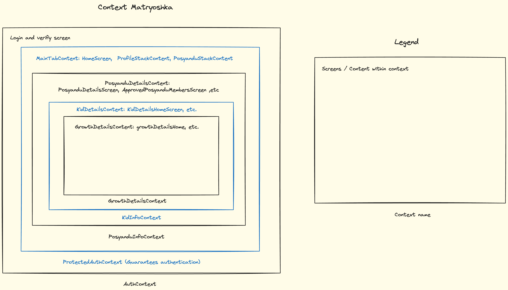

# Denyut Mobile 2

## Overview

Denyut mobile 2 is an android-first client side app. The main goal of this app is to digitize posyandu health tracking.

## Stack and Notable Packages

- React native (Expo)
- Typescript
- React Hook Form
- Zod
- Supabase
- Apollo (For GraphQL)
- Tanstack Query

## Authentication

Authentication is handled using supabase

## Backend

TBD: Info about backend for denyut mobile, link to repo

## Styling

Styling is native-first with tokens support. This means third party component library will be used sparingly, when needed, but if it is simple enough to use basic react native component, then use basic react native component.

This decision is made to reduce the number of unnecessary abstraction layers.

## CI / CD

### Compilation check

Compilation check uses typescript `tsc --noEmit`

To check, execute `npm run ts:check`

### Linting

Linting uses eslint with [expo configuration](https://github.com/expo/expo/tree/main/packages/eslint-config-universe#customizing-prettier) as base, then customization are added, check `.eslintrc.json`.

To check, execute `npm run lint`

### Formatting

Uses [prettier](https://prettier.io/), config is available in `.prettierrc`

To format, execute `npm run format`

TBD: Workflow checks for PR are not in place yet. Until then, make sure before each PR, `npm run check` is executed without issues.

## Development

1. Start development server: `npm run start`
2. Open Expo App, scan barcode shown in the console

## Deployment / Build

### Preview / Testing build (.apk)

1. Execute `npm run build:test`, `eas` will handle the rest (make sure [eas](https://expo.dev/eas) client is installed)
2. Go to eas project `denyut-mobile`, wait for build to finish and download the apk file to android device to test

### Production Build (.aab) and play store deployment

1. For every production build, need to increment `app.json` entry of `expo.android.versionCode` value
2. Wait for build to finish in eas project `denyut-mobile`
3. Once build finishes, download the `.aab` file
4. Go to [denyut posyandu console](https://play.google.com/console/u/0/developers/7095150657835178233/app/4974115026575056198/app-dashboard?timespan=thirtyDays)
5. Go to production release dashboard, click "Create new release"
6. Upload downloaded `.aab` file in (3) and follow instructions
